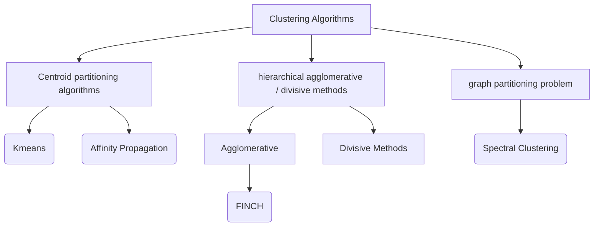

# Selected Paper


## Title: Efficient Parameter-free Clustering Using First Neighbor Relations


## Abstract: 


We present a new clustering method in the form of a single clustering equation that is able to directly discover groupings in the data. The main proposition is that the first neighbor of each sample is all one needs to discover large chains and finding the groups in the data. In contrast to most existing clustering algorithms our method does not require any hyper-parameters, distance thresholds and/or the need to specify the number of clusters. The proposed algorithm belongs to the family of hierarchical agglomerative methods. The technique has a very low computational overhead, is easily scalable and applicable to large practical problems. Evaluation on well known datasets from different domains ranging between 1077 and 8.1 million samples shows substantial performance gains when compared to the existing clustering techniques.


## Link


[https://openaccess.thecvf.com/content_CVPR_2019/html/Sarfraz_Efficient_Parameter-Free_Clustering_Using_First_Neighbor_Relations_CVPR_2019_paper.html](https://openaccess.thecvf.com/content_CVPR_2019/html/Sarfraz_Efficient_Parameter-Free_Clustering_Using_First_Neighbor_Relations_CVPR_2019_paper.html)


[📄 자료 ↗](https://openaccess.thecvf.com/content_CVPR_2019/html/Sarfraz_Efficient_Parameter-Free_Clustering_Using_First_Neighbor_Relations_CVPR_2019_paper.html)


# Paper Review


### Clustering Algorithms





**Clustering**


Let $P$ be a set of objects. 


> ⚙ Objective: Divide $P$ into several groups

- Homogeneity: Objects in the **same cluster should be similar** to each other
- Heterogeneity: Objects in **different clusters should be dissimilar**

**1) Centroid partitioning algorithms**


    Let $k$ be the number of clusters desired and objects $c_1, \dots,c_k$ (which are not necessarily in $P$) are called **centroids**. Clusters $P_1, \dots , P_k$ are formed as follows:


    $$
    P_i = \{ o \in P \mid dist(o,c_i ) \le dist(o,c_j )\quad \forall j\in[1,k]\}
    $$


    $P_i$ includes all the objects in $P$ that have $c_i$ as their nearest centroid.

    - number of cluster $k$ and distance criterion $dist$ is pre-required.
        - Distance measure: between data items
    - Sensitive to the selection of the initial $k$ centroids

**2) Hierarchical agglomerative / disive methods**


    1: Hierarchical agglomerative clustering: Bottom-up approach


    


    

    - Dendrogram: x-axis: distance, 먼저 묶일수록 좌측에 위치

    [https://www.cs.princeton.edu/courses/archive/fall18/cos324/files/hierarchical-clustering.pdf](https://www.cs.princeton.edu/courses/archive/fall18/cos324/files/hierarchical-clustering.pdf)

    - Distance criterion $Dist(\mathcal{G}, \mathcal{G’})$ is pre-required
        - Distance measure: between _groups_ of data items

            


    2: Divisive clustering: Top-down approach


        전체 데이터가 하나의 클러스터로 시작하여 모두 단일 클러스터가 될때까지 분할


    


### Methodology

- 기존의 distance criterion을 사용하는 clustering 방법론들은 공통적으로 high dimensional space에서 차원의 저주로 인해 취약
- Intuition

    실제 거리 measure보다 semantic relation (who is your best friend / or friend of a friend) 사용


    Observed **very first neighbor** of each point is a **sufficient statistic**

- Clustering Equation

    $$
    A(i, j) = 
    \begin{cases} 
    1, & \text{if } j = \kappa_i^1 \text{ or } \kappa_j^1 = i \text{ or } \kappa_i^1 = \kappa_j^1 \\
    0, & \text{otherwise} 
    \end{cases}
    $$


    where $\kappa_i^1$ denotes the first neighbor of point $i$.


    Walk-through:


    


    1st neighbor: 특정 planet으로부터 Euclidean distance가 가장 가까운 planet


    


    $9\times 9$ adjacency matrix $A$ 구성하면 symmetric matrix가 되지 않지만, $\kappa_j^1=i$ 조건으로 symmetric 되도록 유도


        


        FINCH algorithm에 의해 세 개의 cluster 생성

- Proposed Hierarchical Clustering (FINCH Algorithm)

    The notion of clusters one considers true are subjective opinions of the observer. (Hard to find ground-truth clusters)


    Having a list of partitions or a hierarchy instead of a single flat partition should be preferred (w/ **single or average-linkage algorithms** under some similarity functions) (Balcan et al. 2008)

    - 위에서 제시된 Clustering Equation을 recursion 하는 idea로 hierarchy 구성 ⇒ high likelihood of ground-truth recover
    - Hierarchical Clustering linkage scheme: **first-neighbor** (nearest neighbor) approach

        

        - Notation: $\Gamma_i$: Partition $i$, $C_{\Gamma_i}$: total number of clusters in partition $\Gamma_i$

        ```python
        exit_clust = 2
            c_ = c
            k = 1
            num_clust = [num_clust]
        
            while exit_clust > 1:
                adj, orig_dist = clust_rank(mat, use_ann_above_samples, initial_rank, distance, verbose)
                u, num_clust_curr = get_clust(adj, orig_dist, min_sim)
                c_, mat = get_merge(c_, u, data)
        
                num_clust.append(num_clust_curr)
                c = np.column_stack((c, c_))
                exit_clust = num_clust[-2] - num_clust_curr
        
                if num_clust_curr == 1 or exit_clust < 1:
                    num_clust = num_clust[:-1]
                    c = c[:, :-1]
                    break
        
                if verbose:
                    print('Partition {}: {} clusters'.format(k, num_clust[k]))
                k += 1
        
            if req_clust is not None:
                if req_clust not in num_clust:
                    if req_clust > num_clust[0]:
                        print(f'requested number of clusters are larger than FINCH first partition with {num_clust[0]} clusters . Returning {num_clust[0]} clusters')
                        req_c = c[:, 0]
                    else:
                        ind = [i for i, v in enumerate(num_clust) if v >= req_clust]
                        req_c = req_numclust(c[:, ind[-1]], data, req_clust, distance, use_ann_above_samples, verbose)
                else:
                    req_c = c[:, num_clust.index(req_clust)]
            else:
                req_c = None
        
            return c, num_clust, req_c
        ```


최대 $C_{\Gamma_i}$개의 cluster를 가질 수 있기 때문에 required number of cluster를 input으로 지정 가능 (Not recommended)


    ```python
    def req_numclust(c, data, req_clust, distance, use_ann_above_samples, verbose):
        iter_ = len(np.unique(c)) - req_clust
        c_, mat = get_merge([], c, data)
        for i in range(iter_):
            adj, orig_dist = clust_rank(mat, use_ann_above_samples, initial_rank=None, distance=distance, verbose=verbose)
            adj = update_adj(adj, orig_dist)
            u, _ = get_clust(adj, [], min_sim=None)
            c_, mat = get_merge(c_, u, data)
        return c_
    ```

- Toy Data Example (Aggregation Data, Gestalt Data)

    

    1. Normalized Mutual Information (NMI):
    - Measurement similarity between two variables
    - NMI: 0 (no mutual information), 1 (perfect correlation)

    $$
    \text{NMI}(X, Y) = \frac{2 \times \text{MI}(X, Y)}{H(X) + H(Y)}
    $$


    where the Mutual information (MI) is defined as


    $$
    \text{MI}(X, Y) = \sum_{x \in X}\sum_{y \in Y} p(x, y) \log \left(\frac{p(x, y)}{p(x)p(y)}\right) \ge 0
    $$


    Here, $p(x, y)$ is the joint probability distribution function of $X$ and $Y$, and $p(x)$ and $p(y)$ are the marginal probability distribution functions of $X$ and $Y$, respectively.


    cf) The entropy of a random variable $X$ is given by


        $$
        H(X) = -\sum_{x \in X} p(x) \log(p(x))
        $$

    1. unsupervised clustering accuracy (ACC)

        $$
        ACC = max_m \frac{\sum_{i=1}^n 1\{l_i = m(c_i) \}}{n}
        $$


        where $l_i$ is the ground truth label and $c_i$ is the cluster assignment obtained by the method, and $m$ ranges in the all possible one-to-one mappings between clusters and labels.

- Reproduce


# Experiments

- Biological data, text, digits, faces and objects

    

    - Mice Protein: Biological
    - REUTERS: Text
    - STL-10: Objects
    - MNIST: Digits
    - Best NMI score and ground truth cluster number estimation

    

    - Large scale data:

        nearest neighbor 찾을 때 k-d tree와 같은 fast approximate nearest labels 사용하여 10만개 scale, 80만개 scale의 데이터셋에서도 작동


    

    - Run-time 측면에서 다른 clustering method보다 우수한 성능 보임 ($\mathcal{O}(NlogN)$)

        cf) traditional hierarchical agglomerative linkage-based methods ($\mathcal{O}(N^2 log(N)$)


# Discussion

- Cannot discover singletons (clusters with 1 sample)
    - Due to $\kappa_i^1 = \kappa_j^1$ in the Equation 1
    - FINCH Algorithm will always produce smallest cluster with size 2
- Fully parameter-free
- Scalable to large data

# Comments


> 😀 **YongKyung Oh**  
> Lorem ipsum dolor sit amet, consectetur adipiscing elit, sed do eiusmod tempor incididunt ut labore et dolore magna aliqua. Ut enim ad minim veniam, quis nostrud exercitation ullamco laboris nisi ut aliquip ex ea commodo consequat. Duis aute irure dolor in reprehenderit in voluptate velit esse cillum dolore eu fugiat nulla pariatur. Excepteur sint occaecat cupidatat non proident, sunt in culpa qui officia deserunt mollit anim id est laborum.
